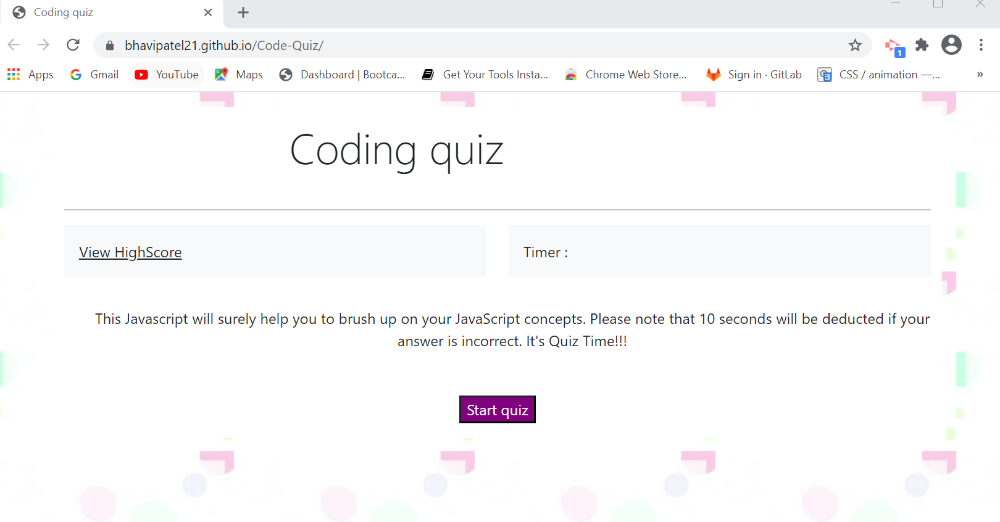
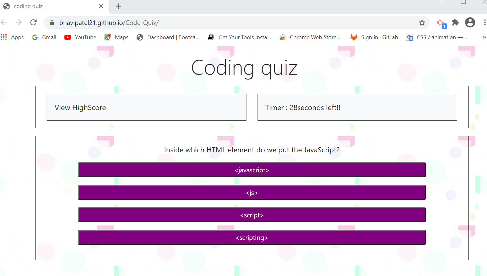
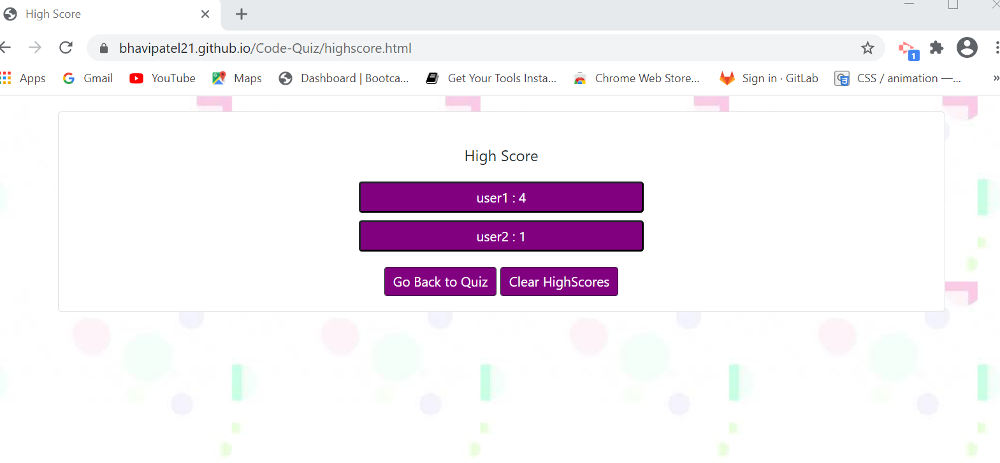

# Code-Quiz
 Javascript Coding quiz
 
## Description 
  As a developer I should build a timed coding quiz with multiple-choice questions. This app will run in the browser and will feature dynamically updated HTML and CSS powered by JavaScript code that you write. It will have a clean, polished, and responsive user interface. 

## User Story
```
AS A coding boot camp student
I WANT to take a timed quiz on JavaScript fundamentals that stores high scores
SO THAT I can gauge my progress compared to my peers
```

## Acceptance Criteria
```
* User should be able to open the webpage without any issues/errors
* User should be able to start quiz once clicked on start button
* User should see timer started once presented with question 
* User should be presented with another question once clicked on answer
* Time should be subtracted from clock when user answers incorrectly
* Once all questions are answered or the timer reaches to 0 quiz is over
* Once quiz is over user should be able to see the score
* Once quiz is over user should be able to save initials and scores
* User should be able navigate to page where they can see the saved initials/scores
* User should be able to clear saved score

```
## Web Url :

Navigate to url : https://bhavipatel21.github.io/Code-Quiz/

## Mock-up :
* Code quiz homepage



* Code quiz questions



* Highscore and User Initial



## PSEUDOCODE 

Step 1.taking a code quiz
* click the start button
* a timer starts 
* presented with a question (will have multiple choice)
* answer a question - ( select option --> action will show correct or incorrect)
* --> if answer a question incorrectly -- time is subtracted from the clock
* presented with another question
* all questions are answered or the timer reaches 0 -- number of questions == 0 or timer == 0 
* the game is over - show the score 
* save my initials + score to localstorage
* submit button and navigate to highscore page
* save/clear score and initial to higscore page


## Test Cases

* Verify user can open the webpage without any issues/errors
* Verify user can click on start button to start quiz
* Verify user is presented with question and timer started
* Verify user is timer started once presented with question  
* Verify User is presented with another question once clicked on answer
* Verify time(10 seconds) is deducted from clock when user answers incorrectly
* Verify once all questions are answered or the timer reaches to 0 quiz is over
* Verify once quiz is over user is be able to see the score
* Verify once quiz is over user should be able to save initials and scores
* Verify user should be able navigate to page where they can see the saved initials/scores
* Verify user should be able to clear the saved score
